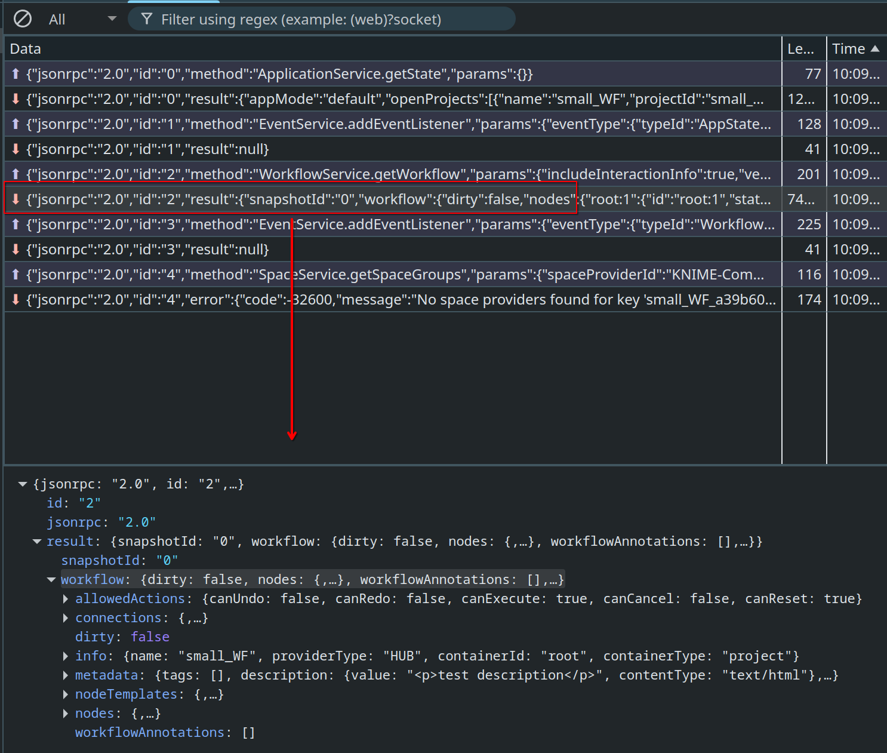

## How to add test fixtures

To obtain data for the fixtures, **you can either log the API calls from the AP in dev mode** or **you can run the AP in the browser** to log the network calls.

### Logging API calls from AP in dev mode

In `store/application/lifecycle.ts` you can log the return values of API calls. E.g. to create a fixture log the return value `project` after `API.workflow.getWorkflow()` in the `loadWorkflow` method. The value will be the `result` field of the JSON RPC object, so in the fxture file make sure to wrap it in

```
{
  "jsonrpc": "2.0",
  "id": "1",
  "result": {[...]}
}
```

### Logging network calls from AP in browser

Refer to the [main README](../README.md) on details how to set up running the AP in the browser.
Once you have that setup ready, point it to a workflow for which you want to create a fixture. Once it opens in the browser, inspect the network tab and in the Websockets section inspect the messages so that you find the message for which you want to create a fixture from. Generally, you will just need the workflow state, but of course you can create a fixture for any other endpoint if you use the corresponding message. Make sure to copy the whole JSON RPC object, not just the data.



## Update test snapshots

You can run the tests and update the snapshots by doing:

```
pnpm test:e2e:update
```

When you run a tests for the first time in your system, Playwright will create a snapshot corresponding to your OS. Future runs will use that snapshot as a comparison. If you want to run a test locally that you have never run before, and for which snapshots do not exist yet for you OS, make sure you commit the snap files (assuming the test passes).

If you don't develop on Linux: you have to commit snapshots for Linux to get the CI passing. You can get them by downloading the artifacts of the failed pipeline (see "Artifacts" tab above the console output).

## Debug tests locally

See [Playwright debugging docs](https://playwright.dev/docs/debug)

and use Playwright interactive UI mode:

```
pnpm test:e2e:ui
```

Sometimes it can be helpful to run the tests in a headed browser, e.g.

```
pnpm test:e2e --headed
```

## Debug issues on CI

If tests fail on CI, it's often helpful to look at the Playwright report and compare the included screenshots. To do so, download the artifacts of the failed pipeline (see "Artifacts" tab above the console output).
